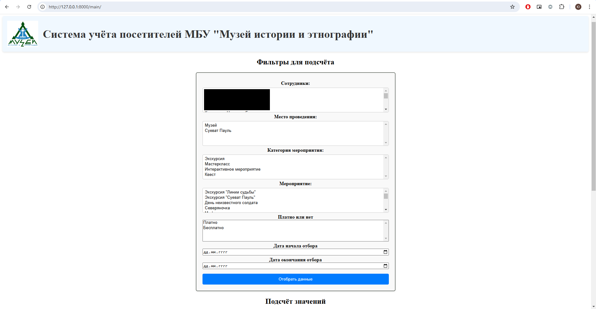
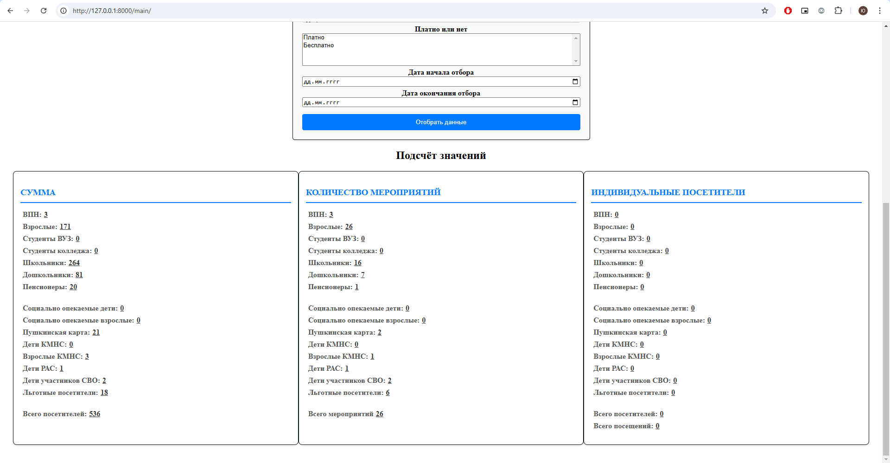
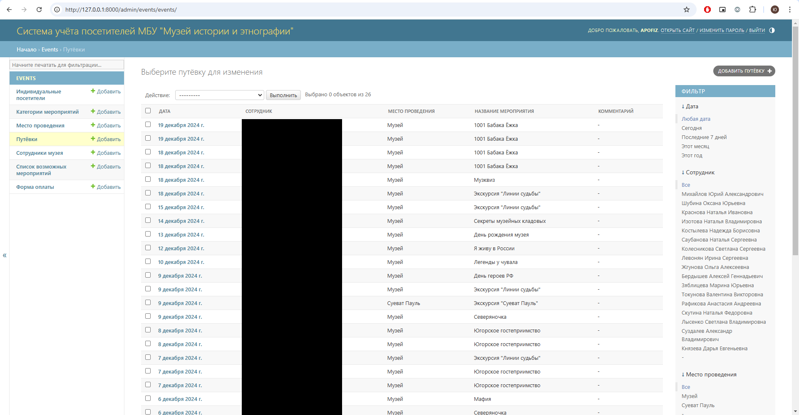

# Система учёта посетителей МБУ "Музей истории и этнографии".

## Описание.
Это веб прилодение для учёта и подсчёта посетителей МБУ "Музй истории и этнографии". Приложение использует python версии Python 3.9.0.


Оно позволяет быстро регестрировать посетителей и классифицировать их по категориям.

## Функциональные возможности.
1. Регистрация новых посетителей с их разбивкой по категориям:
Учёт происходит по категориям:
* ВПН.
* Взрослые.
* Студенты ВУЗ.
* Студенты колледжа.
* Школьники.
* Дошкольники.
* Пенсионеры.
* Социально опекаемые дети.
* Социально опекаемые взрослые.
* Пушкинская карта.
* Дети КМНС.
* Взрослые КМНС.
* РАС.
* Дети участников СВО.
* Льготные посетители.
* Форма оплаты.
* Наличие положительного отзыва.

2. Фильтрация и подсчёт посетителей по следующим фильтрам:
* Сотрудники музея.
* Место проведения.
* Категории мероприятий.
* Форма оплаты.
* Название мероприятия.
* Дата.

## Установка.
1. Клонируйте репозиторий.
2. Установите зависимости с помощью команды
```bash
pip install -r requirements.txt
```
3. Запустите сервер с помощью команды 
```bash
python manage.py runserver.
```

## Использование.
1. Перейдите по адресу в браузере http://127.0.0.1:8000/main/ для фильтрации и подсчёта данных.
2. Перейдите по адресу в браузере http://127.0.0.1:8000/admin для внесения новых данных.

## Скриншоты.




## Лицензия.
Этот проект лицензирован под лицензией MIT - смотрите файл [LICENSE](./LICENSE) для деталей.

## Контакты.
Михайлов Юрий Александрович
mikhailov_ya@mail.ru


 
